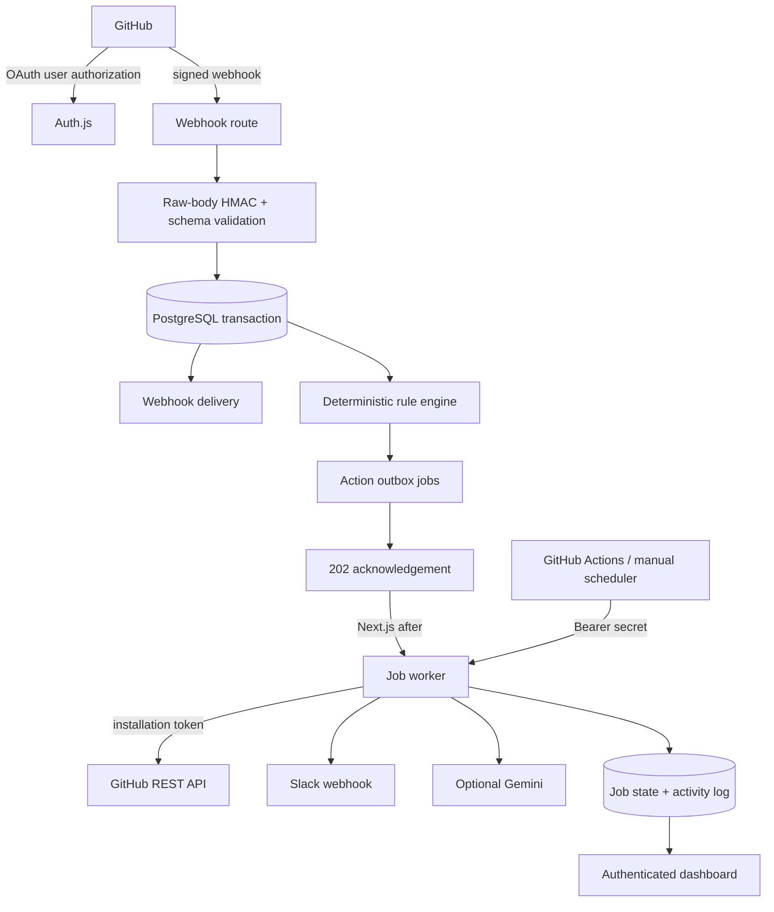

# Hookwise — Event-Driven GitHub Automation Bot

Hookwise is a deployable SaaS application that turns signed GitHub webhook deliveries into reliable repository automation. A user signs in with GitHub, installs the GitHub App on selected repositories, creates deterministic rules, and can add labels, post comments, notify Slack, or request optional Gemini triage when issues and pull requests change.

The hosted evaluation instance is available at [github-event-automator.vercel.app](https://github-event-automator.vercel.app); deployment-specific integrations still require the environment configuration documented below.

This is not a synchronous webhook demo. It validates the exact request bytes, persists the delivery and action outbox transactionally, acknowledges GitHub, and executes each action as an independently retryable job. The dashboard exposes deliveries, duplicate observations, matched rules, attempts, failures, retry timing, and AI results.

The application is a modular Next.js monolith. It needs no paid service: Vercel Hobby (web), Neon or Supabase free Postgres, GitHub Actions (five-minute recovery scheduler for this public repository), Slack Incoming Webhooks, and optional Gemini all have free paths.

## Architecture



The database is both the system of record and a lightweight durable queue. `FOR UPDATE SKIP LOCKED` provides competing-worker claims; a ten-minute lease recovers interrupted work. This is intentionally simpler than introducing a paid queue for a take-home-sized workload.

## Features

### Core

- GitHub OAuth sign-in through Auth.js with server-side route and mutation enforcement.
- GitHub App installation flow with state binding and user-to-installation verification.
- Multi-repository connection and per-repository enable/disable control.
- Exact raw-body `X-Hub-Signature-256` verification using HMAC-SHA256 and constant-time comparison.
- Issue (`opened`, `reopened`), pull request (`opened`, `reopened`, `synchronize`), and push normalization.
- Configurable rule CRUD: event, title keyword, author, label, and one or more actions.
- Real GitHub label and issue/PR comment write-backs via short-lived installation tokens.
- Slack Incoming Webhook notifications.
- Durable per-action jobs, bounded exponential backoff, stale lease recovery, terminal failure state, and manual retry.
- Authenticated overview, delivery/activity, repository, rule, and failure views.
- Structured logs with centralized credential/URL redaction.

### Stretch functionality

- Optional Gemini structured triage with summary, suggested label, priority, and reason.
- AI output schema validation and graceful skip when unconfigured.
- Prompt-injection boundary: repository text is explicitly untrusted data and AI output is advisory.
- Encrypted-at-rest GitHub user access token, used only to verify installation ownership.
- Soft-deleted rules preserve historical action jobs and incident evidence.
- Best-effort post-response execution plus a separate scheduled recovery path.

## Technology choices

- **Next.js 16 + React 19 + TypeScript:** one deployable unit for route handlers, server-rendered protected pages, and server actions. Strict TypeScript catches integration drift without splitting a small product into services.
- **Auth.js:** maintained OAuth state/callback handling. JWT sessions avoid an unnecessary session table; application users still live in PostgreSQL.
- **Drizzle + postgres.js + PostgreSQL:** typed queries, readable SQL migrations, transactional webhook/outbox writes, and database constraints for idempotency. Neon and Supabase both offer suitable free Postgres.
- **`jose`:** RS256 GitHub App JWT creation using Web Crypto-compatible primitives.
- **Zod:** boundary validation for webhook shapes, rules, and AI output.
- **Vitest + PGlite:** unit tests plus execution of the real Postgres migrations and uniqueness constraints without Docker.
- **GitHub Actions scheduler:** public-repository scheduled workflows are a free recovery path. Vercel Hobby cron is not used because its current minimum interval is once per day.

## Local setup

Prerequisites: Node.js 22 LTS, npm, PostgreSQL 15+ (or a free Neon/Supabase database), and a GitHub App.

```bash
git clone https://github.com/sdivyanshu90/github-event-automator.git
cd github-event-automator
npm install
cp .env.example .env.local
```

Fill `.env.local`, then apply migrations and run the application:

```bash
npm run db:migrate
npm run dev
```

Open `http://localhost:3000`. For local GitHub webhooks, expose port 3000 with a free HTTPS tunnel such as `cloudflared tunnel --url http://localhost:3000` or ngrok, and temporarily use the HTTPS origin in the GitHub App configuration. Production never depends on a localhost tunnel.

To drain jobs locally:

```bash
curl -X POST -H "Authorization: Bearer $WORKER_SECRET" http://localhost:3000/api/worker
```

## Environment variables

| Variable | Required | Purpose / source |
|---|---:|---|
| `DATABASE_URL` | Yes | Pooled PostgreSQL URL from Neon, Supabase, or local Postgres. |
| `AUTH_SECRET` | Yes | Auth.js signing secret and AES-GCM key material. Generate with `openssl rand -base64 32`; changing it invalidates sessions and requires users to sign in again. |
| `GITHUB_CLIENT_ID` | Yes | Client ID from the same GitHub App used for automation. |
| `GITHUB_CLIENT_SECRET` | Yes | Client secret from that GitHub App. |
| `GITHUB_APP_ID` | Yes | Numeric App ID from GitHub App settings. |
| `GITHUB_APP_SLUG` | Yes | Slug in `github.com/apps/<slug>`; used to build the install URL. |
| `GITHUB_APP_PRIVATE_KEY` | Yes | Downloaded GitHub App PEM. On one-line hosts replace newlines with literal `\n`. |
| `GITHUB_WEBHOOK_SECRET` | Yes | Random secret configured identically in GitHub App webhook settings. |
| `SLACK_WEBHOOK_URL` | For Slack rules | Slack Incoming Webhook URL. It remains server-only and is redacted from logs. |
| `GEMINI_API_KEY` | No | Google AI Studio free-tier key. Missing configuration skips AI jobs without blocking other actions. |
| `GEMINI_MODEL` | No | Defaults to `gemini-2.5-flash-lite`; keep configurable as model availability changes. |
| `APP_URL` | Yes | Canonical origin, for example `https://hookwise.example.com`, without a trailing slash. |
| `WORKER_SECRET` | Yes | Long random Bearer secret for `/api/worker` and the GitHub Actions scheduler. |
| `CRON_SECRET` | No | Alternative accepted Bearer secret for a hosting scheduler. |
| `WORKER_BATCH_SIZE` | No | Jobs claimed per invocation, default 10 and capped at 50. |
| `LOG_LEVEL` | No | Reserved logging level setting; defaults to `info`. |

`.env*` is ignored except for `.env.example`; the example contains names and safe placeholders only.

## GitHub configuration

Create one GitHub App under **Settings → Developer settings → GitHub Apps → New GitHub App**. This app supplies both OAuth user authorization and installation authentication.

- Homepage URL: `${APP_URL}`
- User authorization callback URL: `${APP_URL}/api/auth/callback/github`
- Setup URL: `${APP_URL}/api/github/setup`
- Webhook URL: `${APP_URL}/api/github/webhook`
- Webhook secret: the value of `GITHUB_WEBHOOK_SECRET`
- Do **not** enable “Request user authorization during installation”; sign-in happens explicitly before installation, preserving the setup URL flow.
- Repository permissions: Metadata read, Issues read/write, Pull requests read, and Contents read.
- Subscribe to events: **Issues**, **Pull request**, and **Push**.

Generate a private key, put its PEM in `GITHUB_APP_PRIVATE_KEY`, and copy the App ID, slug, client ID, and client secret. A user first signs in, then uses **Repositories → Install or configure GitHub App**. The application adds an HTTP-only state value to the install URL, verifies it on return, and asks GitHub whether the signed-in GitHub App user token can access that installation before saving it. The token is AES-256-GCM encrypted under `AUTH_SECRET`; installation tokens are minted on demand and never persisted.

The implementation was checked against GitHub's current documentation for [webhook signatures](https://docs.github.com/en/webhooks/using-webhooks/validating-webhook-deliveries), [App JWTs](https://docs.github.com/en/apps/creating-github-apps/authenticating-with-a-github-app/generating-a-json-web-token-for-a-github-app), [installation tokens](https://docs.github.com/en/apps/creating-github-apps/authenticating-with-a-github-app/generating-an-installation-access-token-for-a-github-app), and the [setup URL spoofing warning](https://docs.github.com/en/apps/creating-github-apps/registering-a-github-app/about-the-setup-url).

## Slack configuration

1. In a Slack workspace, create or select an app.
2. Enable **Incoming Webhooks** and choose **Add New Webhook to Workspace**.
3. Select the target channel and copy the URL into `SLACK_WEBHOOK_URL`.
4. Create a rule with **Send Slack notification** enabled.

One deployment-wide webhook is used in this version. The action adapter is isolated so per-user destinations or another notification provider can be added without changing ingestion or rule matching.

## Optional Gemini configuration

Create a free Google AI Studio API key and set `GEMINI_API_KEY`. AI jobs receive only event type, title, body, and labels—never application credentials. The system instruction labels repository content as untrusted data, Gemini is asked for schema-constrained JSON, and Zod validates the response. AI suggestions are displayed and included in Slack when already available; they never authorize access or perform deterministic matching.

## Database and migrations

The normalized schema is in `src/db/schema.ts`; committed SQL migrations are under `drizzle/`.

```bash
npm run db:generate  # after intentional schema edits
npm run db:migrate   # apply pending migrations
npm run db:studio    # optional local inspection
```

Important constraints include unique `webhook_deliveries.delivery_id` and unique `(delivery_id, rule_id, action_type)` action jobs. GitHub numeric identifiers are stored as text to avoid JavaScript integer precision assumptions.

## Reliability design

1. The webhook route reads the body once as bytes and rejects an invalid/missing HMAC before parsing or writing.
2. A transaction associates the repository, inserts the unique delivery, normalizes the event, evaluates enabled rules, and inserts unique action jobs.
3. The route returns `202` only after the transaction commits. A duplicate delivery returns `200`, atomically increments its observation count, and creates no jobs.
4. Next.js `after()` starts a best-effort drain after the response. The scheduled workflow and manual endpoint recover anything left pending.
5. Workers atomically claim due work with `FOR UPDATE SKIP LOCKED`, use ten-minute leases, and record every attempt.
6. Retryable 429/5xx/network failures use 30s, 2m, 10m, and 30m backoff; invalid requests, authentication/permission failures, and exhausted work become terminal.
7. Successful sibling jobs remain completed when another provider fails. Labels are naturally idempotent; comments carry a job marker and are checked before posting.

## Security

- Dashboard pages and every mutation query require a server-side Auth.js session and constrain resources by `user_id`.
- Auth.js supplies OAuth state/callback protection. GitHub App installation uses a separate short-lived, HTTP-only state cookie and GitHub user-token ownership check.
- Webhook verification uses original bytes and constant-time comparison. Header and payload shapes are validated before use.
- Private keys, webhook/OAuth/worker secrets, installation tokens, Slack URLs, and AI keys exist only in server modules/environment variables.
- GitHub user tokens are encrypted at rest; short-lived installation tokens are not stored.
- Central logging redacts sensitive field names, Slack webhook URLs, GitHub token prefixes, and Bearer values. Provider errors shown to users are bounded and sanitized.
- Server Actions provide framework CSRF protection; external redirects are fixed destinations, and sign-in callback paths accept internal paths only.
- User content is rendered as React text. No raw HTML injection is used.

## Testing and quality checks

```bash
npm test
npm run lint
npm run typecheck
npm run build
npm audit --omit=dev
```

Tests cover valid/invalid/missing/modified webhook signatures; issue/PR/push normalization; deterministic rule conditions; bounded retries; GitHub request semantics and comment markers; Slack payloads and error classification; AI schema/failure/prompt-injection behavior; installation state; credential encryption; and real migration-backed database idempotency via PGlite.

## Free-tier deployment (Vercel + Neon)

1. Create a free Neon Postgres project and copy its pooled URL.
2. From a trusted local environment, set production `DATABASE_URL` and run `npm run db:migrate`.
3. Import this repository into Vercel, select Node.js 22, and add all required environment variables. The default build command is `npm run build`.
4. Deploy, set `APP_URL` to the assigned production origin, and redeploy.
5. Update the GitHub App homepage, callback, setup, and webhook URLs to the production origin.
6. In this repository's **Settings → Secrets and variables → Actions**, add `APP_WORKER_URL` (production origin without a trailing slash) and `WORKER_SECRET` (the deployed worker secret).
7. Enable Actions. `.github/workflows/worker.yml` drains recovery work every five minutes and can also be run manually.

Vercel Hobby currently permits only once-daily cron schedules, so `vercel.json` intentionally contains no frequent cron. If deploying on a host with a free background worker or scheduler, invoke `POST /api/worker` with `Authorization: Bearer <WORKER_SECRET>` at one-to-five-minute intervals instead.

## Evaluator demo path

1. Sign in with GitHub.
2. Open **Repositories**, install the GitHub App, select a repository, and return to the app.
3. Create an `issues.opened` rule with title containing `bug`; enable **Add label** and optionally Slack/AI.
4. Open an issue whose title contains `bug`.
5. Observe the GitHub label/comment and Slack message. For an immediate demo, manually run **Drain durable action jobs** in GitHub Actions or call the protected worker endpoint.
6. Open **Activity** for the delivery, rule match, action result, attempts, duplicate count, and AI result. Use **Failures** to inspect/requeue terminal work.

## Known limitations

- PostgreSQL polling is appropriate for this scale, but not a substitute for a high-throughput queue with dead-letter tooling.
- Slack Incoming Webhooks provide no idempotency key. A process crash after Slack accepts a request but before the completion commit can produce a duplicate notification on lease recovery.
- Comment deduplication checks the 100 most recent comments for its hidden job marker.
- Repository synchronization is setup-flow driven; installation deletion/suspension webhooks are not yet modeled.
- Expiring GitHub App user tokens are not refreshed in the background; a user must sign in again before resynchronizing when that token expires.
- Slack is deployment-wide rather than per user, and there is no Slack OAuth connection UI.
- Push rules intentionally support only event matching in this first rule model.
- External GitHub, Slack, and Gemini calls require real credentials and were mocked in automated tests; no live third-party action or production deployment is claimed.
